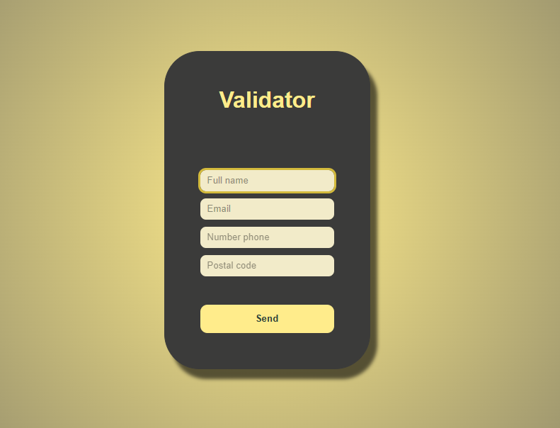

<h1 align= "center">Form Validator</h1>

   > Status: Completed ✔️ 

  

    This is a React project for form validation, using Jest and React Testing Library for automated testing.
  

  <h2>Features</h2>

  <ul>
    <li>Interactive form validation.</li>
    <li>Automated tests to ensure robustness.</li>
  </ul>

  <h2>Tools Used</h2>

  <ul>
    <li><strong>React:</strong> JavaScript library for building user interfaces.</li>
    <li><strong>Jest:</strong> JavaScript testing framework, used for testing React code.</li>
    <li><strong>React Testing Library:</strong> Library for testing React components, focusing on user interactions.</li>
  </ul>

  <h2>How to Run Tests</h2>

  
To run the tests, make sure you have Node.js and npm installed. Then, run:

  <pre>
    <code>
      npm test
    </code>
  </pre>

  <h2>Usage of useState</h2>

  

    This project utilizes React's <code>useState</code> hook for managing state in functional components.
    The <code>useState</code> hook allows the functional components to manage state, enabling them to be more interactive.
    In this project, it is used for managing the form state, tracking changes in the form fields.
  

  <h2>Contributing</h2>

  
Contributions are welcome! Feel free to submit pull requests.

 
